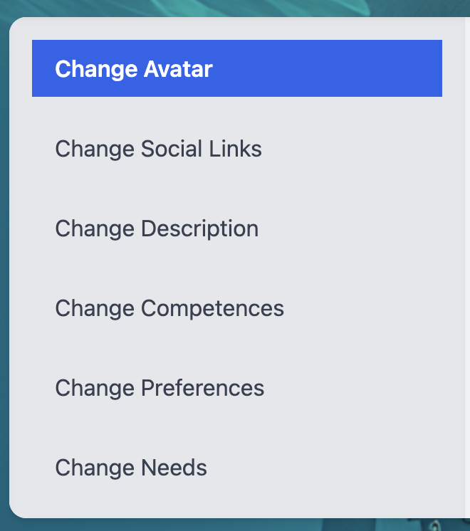

## Constants

<dl>
<dt><a href="#checkNameUniqueness">checkNameUniqueness</a> ⇒ <code>Promise.&lt;boolean&gt;</code></dt>
<dd>
Checks if a given name is unique among users.

</dd>
<dt><a href="#incrementSelectedCounts">incrementSelectedCounts</a> ⇒ <code>Promise.&lt;void&gt;</code></dt>
<dd>
Increments the counts of selected items in the ikigai categories.

</dd>
<dt><a href="#updateSelectedCounts">updateSelectedCounts</a> ⇒ <code>Promise.&lt;void&gt;</code></dt>
<dd>
Updates the counts of selected items in the ikigai categories.

</dd>
<dt><a href="#getIkigaiElements">getIkigaiElements</a> ⇒ <code>Promise.&lt;Object&gt;</code></dt>
<dd>
Retrieves the elements of the ikigai categories, sorted by their counts.

</dd>
<dt><a href="#getAllUsers">getAllUsers</a></dt>
<dd>
Sets all users in the provided callback.

</dd>
<dt><a href="#getSingleUser">getSingleUser</a></dt>
<dd>
Sets the current user in the provided callback, based on the given email.

</dd>
<dt><a href="#postUserData">postUserData</a></dt>
<dd>
Posts user data to the Firestore.

</dd>
<dt><a href="#getCurrentUser">getCurrentUser</a></dt>
<dd>
Sets the current user in the Redux store based on the user&#39;s email in localStorage.

</dd>
<dt><a href="#editProfile">editProfile</a> ⇒ <code>Promise.&lt;void&gt;</code></dt>
<dd>
Edits the user&#39;s profile with the provided data.

</dd>
<dt><a href="#addDatatoUser">addDatatoUser</a> ⇒ <code>Promise.&lt;void&gt;</code></dt>
<dd>
Adds data to the user&#39;s profile.

</dd>
</dl>

## Functions

<dl>
<dt><a href="#NavigationMenu">NavigationMenu(props)</a> ⇒ <code>JSX.Element</code></dt>
<dd>
Renders a navigation menu to switch between different user edit forms.

</dd>
<dt><a href="#Account">Account()</a> ⇒ <code>JSX.Element</code></dt>
<dd>
Renders a user account management interface.
Provides options for the user to edit their avatar, social links, description, competences, preferences, and needs.

</dd>
<dt><a href="#CharacterCreation">CharacterCreation()</a> ⇒ <code>JSX.Element</code></dt>
<dd>
Renders the character creation interface.
Guides the user through a multi-step form to provide their avatar, social links, description, competences, preferences, and needs.

</dd>
</dl>

## checkNameUniqueness ⇒ <code>Promise.&lt;boolean&gt;</code>
Checks if a given name is unique among users.

**Kind**: global constant  
**Returns**: <code>Promise.&lt;boolean&gt;</code> - A promise that resolves to true if the name is unique, false otherwise.  

| Param | Type | Description |
| --- | --- | --- |
| name | <code>string</code> | The name to check for uniqueness. |

## incrementSelectedCounts ⇒ <code>Promise.&lt;void&gt;</code>
Increments the counts of selected items in the ikigai categories.

**Kind**: global constant  
**Returns**: <code>Promise.&lt;void&gt;</code> - A promise that resolves when the counts have been incremented.  

| Param | Type | Description |
| --- | --- | --- |
| selectedItems | <code>Object</code> | An object containing selected items per category. |

## updateSelectedCounts ⇒ <code>Promise.&lt;void&gt;</code>
Updates the counts of selected items in the ikigai categories.

**Kind**: global constant  
**Returns**: <code>Promise.&lt;void&gt;</code> - A promise that resolves when the counts have been updated.  

| Param | Type | Description |
| --- | --- | --- |
| newSelections | <code>Object</code> | An object containing the new selected items per category. |
| previousSelections | <code>Object</code> | An object containing the previous selected items per category. |

## getIkigaiElements ⇒ <code>Promise.&lt;Object&gt;</code>
Retrieves the elements of the ikigai categories, sorted by their counts.

**Kind**: global constant  
**Returns**: <code>Promise.&lt;Object&gt;</code> - A promise that resolves to an object containing the sorted elements per category.  

## getAllUsers
Sets all users in the provided callback.

**Kind**: global constant  

| Param | Type | Description |
| --- | --- | --- |
| setAllUsers | <code>function</code> | A function that sets the list of all users. |

## getSingleUser
Sets the current user in the provided callback, based on the given email.

**Kind**: global constant  

| Param | Type | Description |
| --- | --- | --- |
| setCurrentUser | <code>function</code> | A function that sets the current user. |
| email | <code>string</code> | The email of the user to set as the current user. |

## postUserData
Posts user data to the Firestore.

**Kind**: global constant  

| Param | Type | Description |
| --- | --- | --- |
| object | <code>Object</code> | The user data to be posted. |

## getCurrentUser
Sets the current user in the Redux store based on the user's email in localStorage.

**Kind**: global constant  

| Param | Type | Description |
| --- | --- | --- |
| dispatch | <code>function</code> | The Redux dispatch function. |

## editProfile ⇒ <code>Promise.&lt;void&gt;</code>
Edits the user's profile with the provided data.

**Kind**: global constant  
**Returns**: <code>Promise.&lt;void&gt;</code> - A promise that resolves when the profile has been updated.  

| Param | Type | Description |
| --- | --- | --- |
| userID | <code>string</code> | The ID of the user to edit. |
| payload | <code>Object</code> | The data to update the user's profile with. |

## addDatatoUser ⇒ <code>Promise.&lt;void&gt;</code>
Adds data to the user's profile.

**Kind**: global constant  
**Returns**: <code>Promise.&lt;void&gt;</code> - A promise that resolves when the data has been added to the profile.  

| Param | Type | Description |
| --- | --- | --- |
| userID | <code>string</code> | The ID of the user to add data to. |
| payload | <code>Object</code> | The data to add to the user's profile. |

## NavigationMenu(props) ⇒ <code>JSX.Element</code>
Renders a navigation menu to switch between different user edit forms.

**Kind**: global function  
**Summary**: NavigationMenu component.  
**Returns**: <code>JSX.Element</code> - The rendered navigation menu.  

| Param | Type | Description |
| --- | --- | --- |
| props | <code>Object</code> | Component properties. |
| props.onSelect | <code>function</code> | A callback function that is called when a menu item is selected. |

## Account() ⇒ <code>JSX.Element</code>
Renders a user account management interface.
Provides options for the user to edit their avatar, social links, description, competences, preferences, and needs.

**Kind**: global function  
**Summary**: Account component.  
**Returns**: <code>JSX.Element</code> - The rendered Account component.  
**Requires**: <code>module:react:</code>, <code>module:react-redux:</code>, <code>module:../api/FirestoreAPI:</code>, <code>module:../components/UI/character-creation/AvatarForm:</code>, <code>module:../components/UI/character-edit/SocialLinksEditForm:</code>, <code>module:../components/UI/character-edit/DescriptionEditForm:</code>, <code>module:../components/UI/character-edit/CompetencesEditForm:</code>, <code>module:../components/UI/character-edit/PreferencesEditForm:</code>, <code>module:../components/UI/character-edit/NeedsEditForm:</code>  

## CharacterCreation() ⇒ <code>JSX.Element</code>
Renders the character creation interface.
Guides the user through a multi-step form to provide their avatar, social links, description, competences, preferences, and needs.

**Kind**: global function  
**Summary**: CharacterCreation component.  
**Returns**: <code>JSX.Element</code> - The rendered CharacterCreation component.  
**Requires**: <code>module:react:</code>, <code>module:next/router:</code>, <code>module:../firebase-config:</code>, <code>module:../api/FirestoreAPI:</code>, <code>module:react-toastify:</code>, <code>module:../components/UI/character-creation/AvatarForm:</code>, <code>module:../components/UI/character-creation/SocialLinksForm:</code>, <code>module:../components/UI/character-creation/DescriptionForm:</code>, <code>module:../components/UI/character-creation/CompetencesForm:</code>, <code>module:../components/UI/character-creation/NeedsForm:</code>, <code>module:../components/UI/character-creation/PreferencesForm:</code>  
